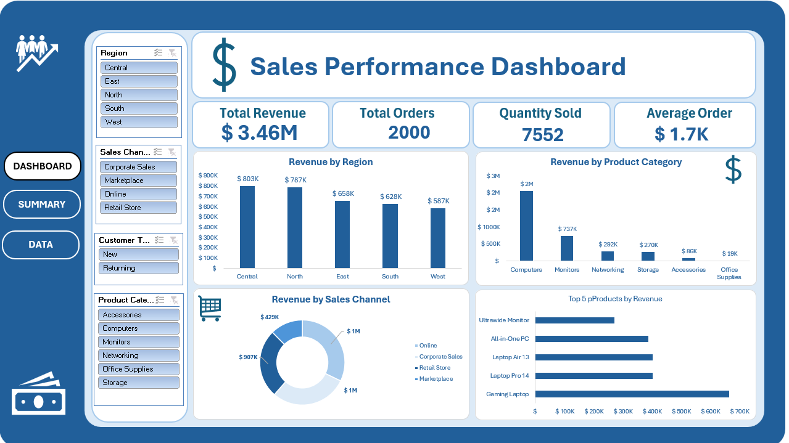
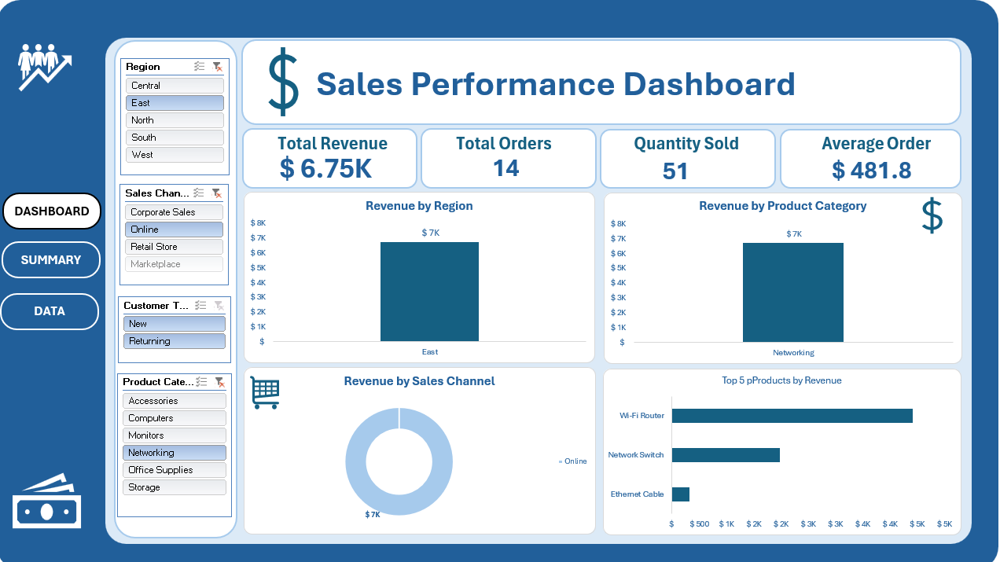

# Sales Analytics Dashboard

An interactive **Sales Analytics Dashboard** built in Microsoft Excel to analyze revenue, orders, quantity, regional performance, product categories, sales channels, and top-performing products.

## 📊 Dashboard Preview

### Sales Dashboard

### Filtered View

## 🎯 Project Objective

The goal of this project is to transform raw sales data into an interactive dashboard that provides a clear overview of sales performance and helps identify the main revenue-generating regions, categories, channels, and products.

## 📌 Key KPIs

| KPI                       |      Value |
| ------------------------- | ---------: |
| Total Revenue             | **$3.46M** |
| Total Orders              |  **2,000** |
| Total Quantity            |  **7,552** |
| Average Revenue per Order |  **$1.7K** |

## 📈 Analysis

### Revenue by Region

* Central — **$803K**
* North — **$787K**
* East — **$658K**
* South — **$628K**
* West — **$587K**

### Revenue by Category

* Computers — **$2M**
* Monitors — **$737K**
* Networking — **$292K**
* Storage — **$270K**
* Accessories — **$86K**
* Office Supplies — **$19K**

### Revenue by Sales Channel

* Corporate Sales — **$1M**
* Online — **$1M**
* Retail Store — **$907K**
* Marketplace — **$429K**

### Top Products by Revenue

* Gaming Laptop — **$666K**
* Laptop Pro 14 — **$404K**
* Laptop Air 13 — **$403K**
* All-in-One PC — **$390K**
* Ultrawide Monitor — **$272K**

## 🛠️ Tools & Techniques

* **Microsoft Excel**
* Pivot Tables
* Pivot Charts
* Slicers
* KPI Cards
* Data Aggregation
* Data Visualization
* Interactive Filtering

## 📂 Project Files

| File                 | Description                                                |
| -------------------- | ---------------------------------------------------------- |
| `sales.xlsx`         | Excel workbook containing the sales analysis and dashboard |
| `salesdashboard.png` | Main dashboard screenshot                                  |
| `Sales.png`          | Filtered dashboard screenshot                              |

## 💡 Key Takeaways

The analysis shows that **Computers** generate the largest share of revenue among the analyzed categories. Among regions, **Central** has the highest revenue, while **Gaming Laptop** is the highest-revenue product in the displayed product analysis.

The dashboard also provides a comparison of different sales channels, with **Corporate Sales and Online** each generating approximately **$1M** in revenue.

## 📚 Skills Demonstrated

This project demonstrates practical experience in:

* Building interactive Excel dashboards
* Working with Pivot Tables and Pivot Charts
* Creating KPI-driven visualizations
* Using Slicers for interactive analysis
* Comparing business performance across dimensions
* Presenting sales data in a clear and accessible format
